<h1 align="center">
  <a href="https://github.com/pokerlost/bot">
    <!-- Please provide path to your logo here -->
    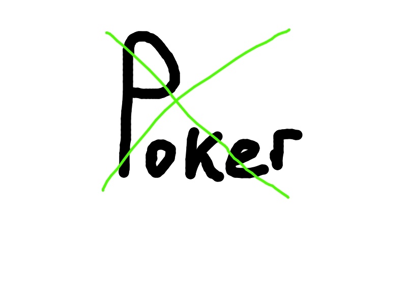
  </a>
</h1>

<div align="center">
  bot
  <br />
  <a href="#about"><strong>Explore the screenshots »</strong></a>
  <br />
  <br />
  <a href="https://github.com/pokerlost/bot/issues/new?assignees=&labels=bug&template=01_BUG_REPORT.md&title=bug%3A+">Report a Bug</a>
  ·
  <a href="https://github.com/pokerlost/bot/issues/new?assignees=&labels=enhancement&template=02_FEATURE_REQUEST.md&title=feat%3A+">Request a Feature</a>
  .
  <a href="https://github.com/pokerlost/bot/issues/new?assignees=&labels=question&template=04_SUPPORT_QUESTION.md&title=support%3A+">Ask a Question</a>
</div>


---

## About

> Telegram-bot that allows you to play poker variants of Texas Hold'em. It is able to create rooms, perform poker game action, find winners based on combinations and correctly divide the bank between them.

<details>
<summary>Screenshots</summary>
<br>

> **[?]**
> Please provide your screenshots here.

|                                                     Start Page                                                     |                                                  Start Poker Page                                                  |
|:------------------------------------------------------------------------------------------------------------------:|:------------------------------------------------------------------------------------------------------------------:|
|                       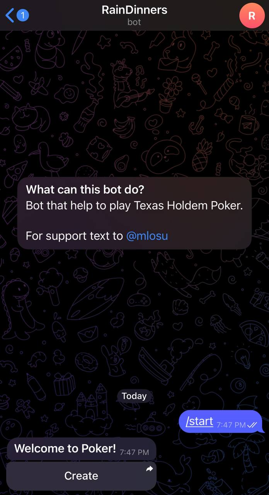                       |                 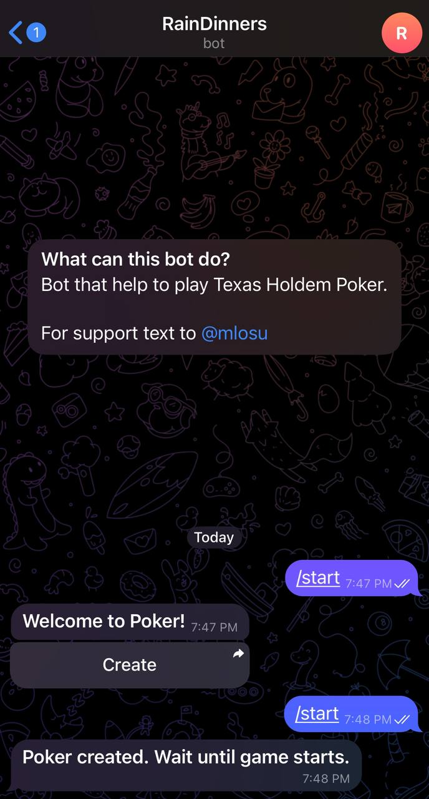                 |
|                                                    Create Page                                                     |                                                     Join Page                                                      |
|                      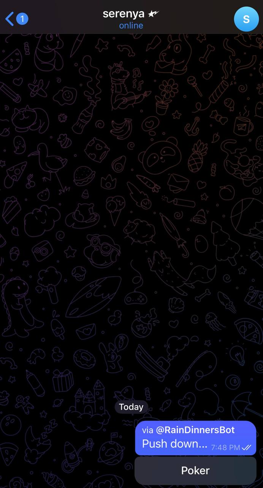                      |                        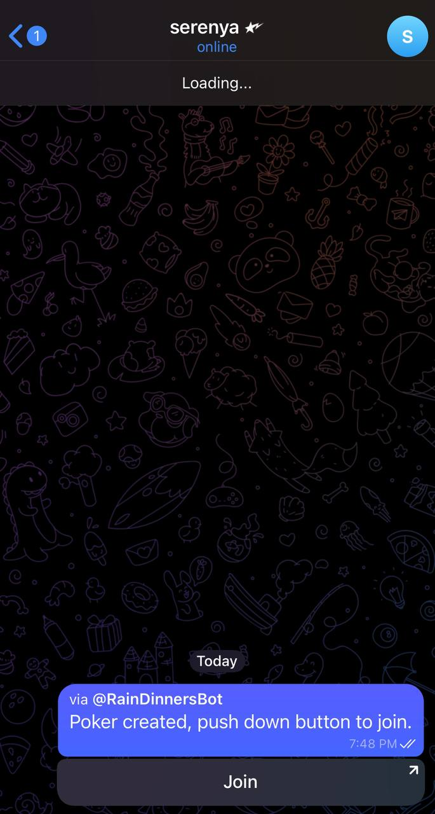                        |
|                                                Poker Starting Page                                                 |                                                 Main Preflop Page                                                  |
|              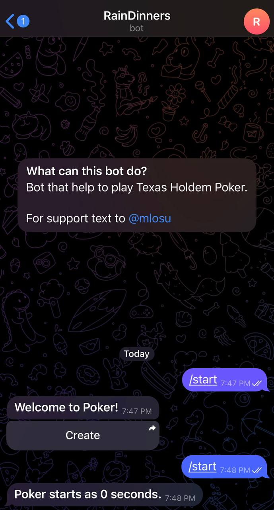              |                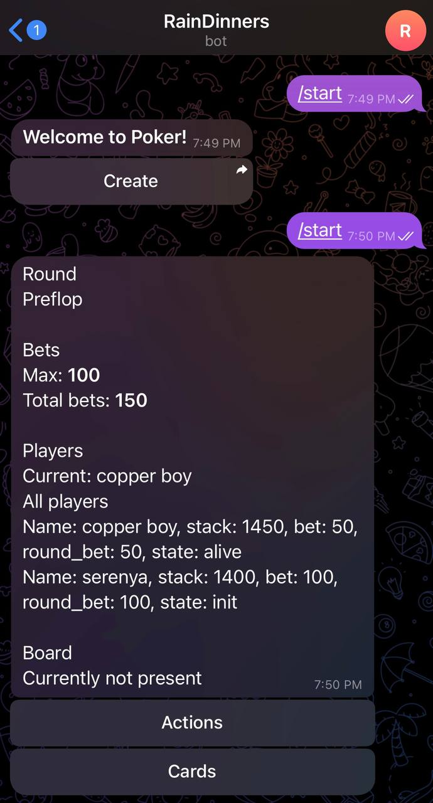                |
|                                                   Main Flop Pag                                                    |                                                     Cards Page                                                     |
|                     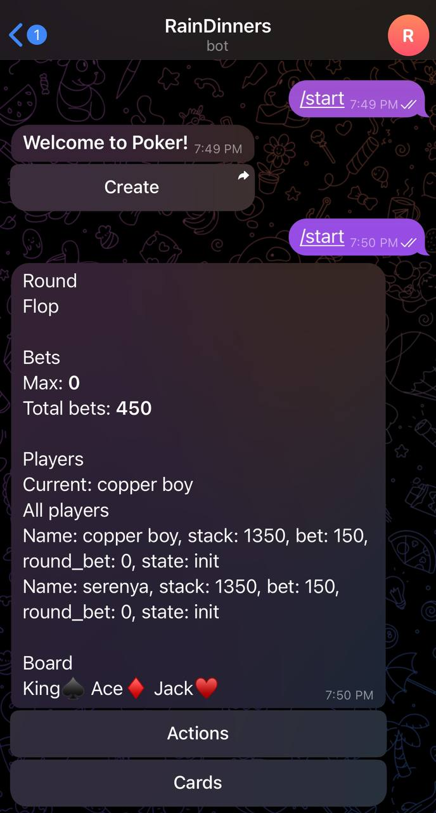                      |                       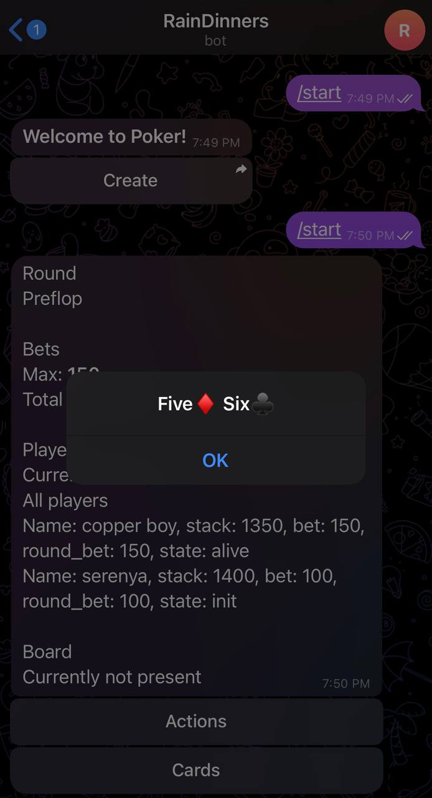                       |
|                                                Actions Default Page                                                |                                                 Enter Amount Page                                                  |
|                          |                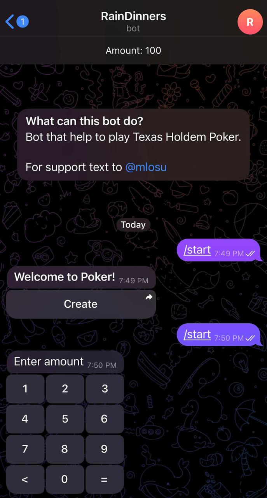                |
|                                          Actions With Custom Amount Page                                           |                                          Actions With Custom Amount Page                                           |
|  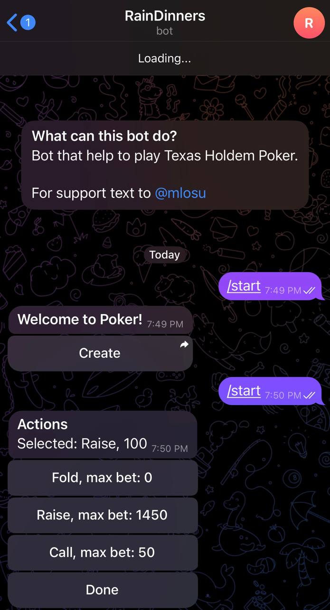  |    |
|                                              Winners All Exited Page                                               |                                              Winners Combination Page                                              |
|          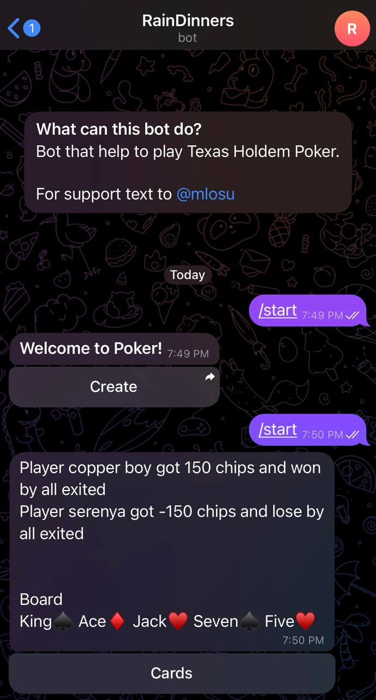          |                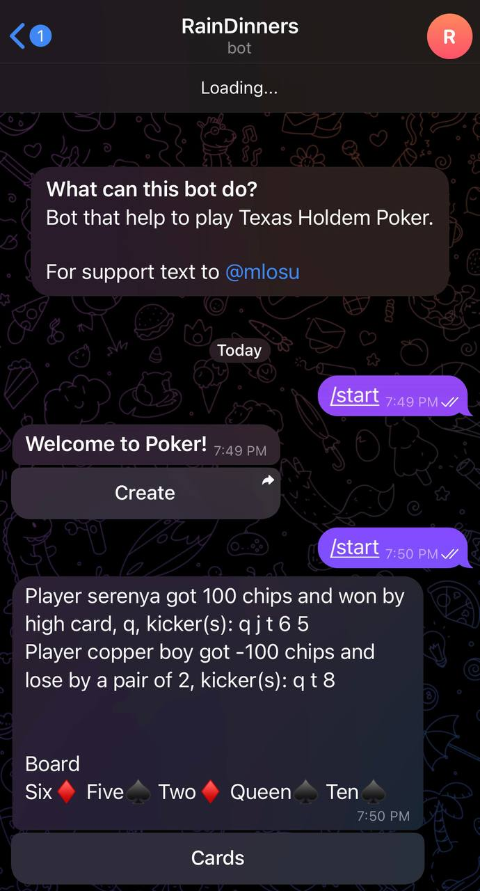                 |

</details>

### Built With

> Python aiogram pydantic-settings apscheduler pokerengine

## Getting Started

### Prerequisites

> **[?]**
> linux python3.1* docker

### Installation

```shell
git clone https://github.com/pokerlost/bot && cd bot
mv .env_dist .env  # edit your environment variables
docker compose -f docker/compose/app.yml -f docker/comopse/redis.yml -f docker/compose/networks.yml up --build
```

## Usage

Go to Telegram linked bot and apply command `/start` of them.

## Roadmap

See the [open issues](https://github.com/pokerlost/bot/issues) for a list of proposed features (and known issues).

- [Top Feature Requests](https://github.com/pokerlost/bot/issues?q=label%3Aenhancement+is%3Aopen+sort%3Areactions-%2B1-desc) (
  Add your votes using the 👍 reaction)
- [Top Bugs](https://github.com/pokerlost/bot/issues?q=is%3Aissue+is%3Aopen+label%3Abug+sort%3Areactions-%2B1-desc) (Add
  your votes using the 👍 reaction)
- [Newest Bugs](https://github.com/pokerlost/bot/issues?q=is%3Aopen+is%3Aissue+label%3Abug)

## Support

Reach out to the maintainer at one of the following places:

- [GitHub issues](https://github.com/pokerlost/bot/issues/new?assignees=&labels=question&template=04_SUPPORT_QUESTION.md&title=support%3A+)
- Contact options listed on [this GitHub profile](https://github.com/pokerlost)
- Contact with [Telegram](https://mlosu.t.me)

## Contributing

First off, thanks for taking the time to contribute! Contributions are what make the open-source community such an
amazing place to learn, inspire, and create. Any contributions you make will benefit everybody else and are **greatly
appreciated**.

Please read [our contribution guidelines](docs/CONTRIBUTING.md), and thank you for being involved!

## Authors & contributors

The original setup of this repository is by [pokertlost](https://github.com/pokerlost).

For a full list of all authors and contributors,
see [the contributors page](https://github.com/pokerlost/bot/contributors).

## License

This project is licensed under the **MIT license**.

See [LICENSE](LICENSE) for more information.

